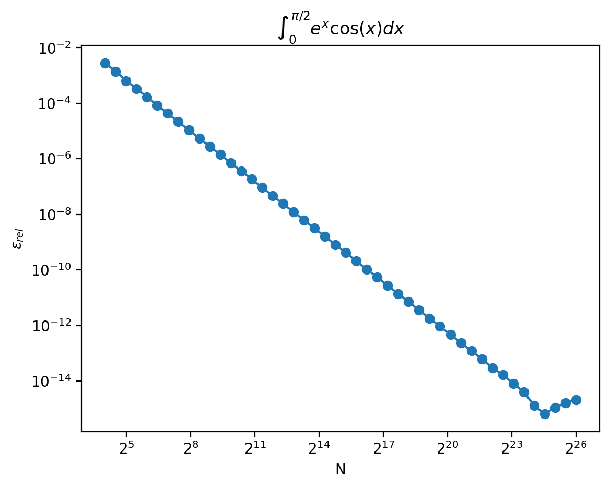

# task 04 handout

I provide the solution to this task in C and Python.

## Answers

### 1

The relative error depends on the number of discretization steps. A plot showing the results can be found below.

### 2

The most direct way would be to reduce the length of the discretization step or, equivalently, increasing the number of points used for the calulation. An alternative could be to use more sophisticated methods like Runge-Kutta.

### 3

The lowest relative error I've found corresponds to performing a discretization with $N=2^23$ equal length steps and is of order $\epsilon_{rel} \sim 10^{-14}$.
